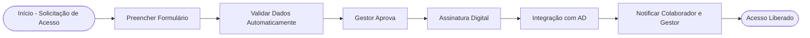

# 1. Contexto

O processo atual de solicitação de acesso é manual, baseado em preenchimento de formulário, conferência individual de dados e envio de termos de responsabilidade por e-mail. Esse modelo gera retrabalho, atrasos e dependência de pessoas específicas para validação.

O objetivo deste documento é propor um cenário ideal (TO-BE) que reduza etapas manuais, aumente a segurança e integre com o AD (Active Directory).

---

# 2. Escopo do Projeto

Automatizar e padronizar o processo de solicitação de acesso de colaboradores/servidores, incluindo:

- Preenchimento do formulário online
- Validação automática de dados obrigatórios
- Assinatura digital integrada
- Notificações automáticas de status
- Integração final com o AD para criação/liberação de usuários e permissões

---

# 3. Requisitos Funcionais (RF)

## Formulário Online Inteligente

- **RF-01:** Validar campos obrigatórios em tempo real (CPF, matrícula, e-mail, telefone)
- **RF-02:** Impedir avanço caso haja inconsistências (ex.: e-mails diferentes nos campos de confirmação)
- **RF-03:** Permitir anexar documentos adicionais, se necessário

## Gestão de Fluxo e Aprovação

- **RF-04:** Enviar automaticamente a solicitação para o gestor responsável
- **RF-05:** Permitir que o gestor aprove/reprove via portal ou notificação
- **RF-06:** Notificar o colaborador sobre o status da solicitação (aprovada, pendente, reprovada)

## Assinatura Digital

- **RF-07:** Integrar com solução de assinatura eletrônica (Gov.br, certificado digital ou outro provedor homologado)
- **RF-08:** Substituir o envio manual de termo em PDF por assinatura diretamente no sistema
- **RF-09:** Garantir rastreabilidade da assinatura (data, hora, responsável)

## Integração com AD e Sistemas Internos

- **RF-10:** Criar automaticamente usuário/rede no AD quando aprovação for concluída
- **RF-11:** Permitir escolha de perfis de acesso pré-configurados (ex.: E-mail Oficial, Login de Rede, Pasta de Compartilhamento)
- **RF-12:** Registrar logs das operações para auditoria

## Relatórios e Dashboard

- **RF-13:** Gerar relatórios de solicitações (pendentes, aprovadas, concluídas)
- **RF-14:** Exibir tempo médio de processamento
- **RF-15:** Permitir exportação em PDF/Excel

---

# 4. Requisitos Não Funcionais (RNF)

- **RNF-01:** O sistema deve ser responsivo e acessível em navegadores desktop e mobile
- **RNF-02:** Tempo de resposta para validação de formulário deve ser inferior a 2 segundos
- **RNF-03:** Assinaturas devem seguir padrões de conformidade legal (ICP-Brasil ou equivalentes)
- **RNF-04:** Integração com AD deve ocorrer em até 5 minutos após aprovação
- **RNF-05:** O sistema deve armazenar logs por, no mínimo, 5 anos

---

# 5. Regras de Negócio (RN)

- **RN-01:** Toda solicitação deve ter gestor responsável definido
- **RN-02:** Assinaturas de gestor e colaborador são obrigatórias antes da liberação
- **RN-03:** Solicitações com dados incompletos não podem avançar para validação
- **RN-04:** Caso o gestor não aprove em até X dias, a solicitação expira automaticamente (valor a definir pela área de cadastro)
- **RN-05:** Apenas solicitações com documento válido (assinatura reconhecida digitalmente) podem gerar criação de usuário no AD

---

# 6. Cenário TO-BE (Visão Ideal)

1. Colaborador acessa portal e preenche formulário inteligente
2. Sistema valida dados obrigatórios automaticamente
3. Solicitação é enviada para gestor aprovar digitalmente
4. Gestor assina eletronicamente no próprio sistema
5. Fluxo segue para TI/AD, que cria o usuário de forma automatizada
6. Colaborador e gestor recebem notificações de conclusão
7. Relatório é atualizado em tempo real

---

# 7. Benefícios Esperados

- Redução de retrabalho e erros manuais
- Eliminação da troca de anexos por e-mail
- Agilidade na liberação de acessos
- Maior segurança jurídica e de auditoria (assinatura digital + logs)
- Transparência para colaborador e gestor sobre o status da solicitação

# 8. Fluxo

